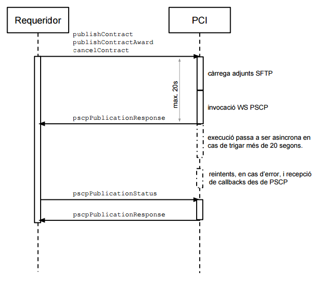
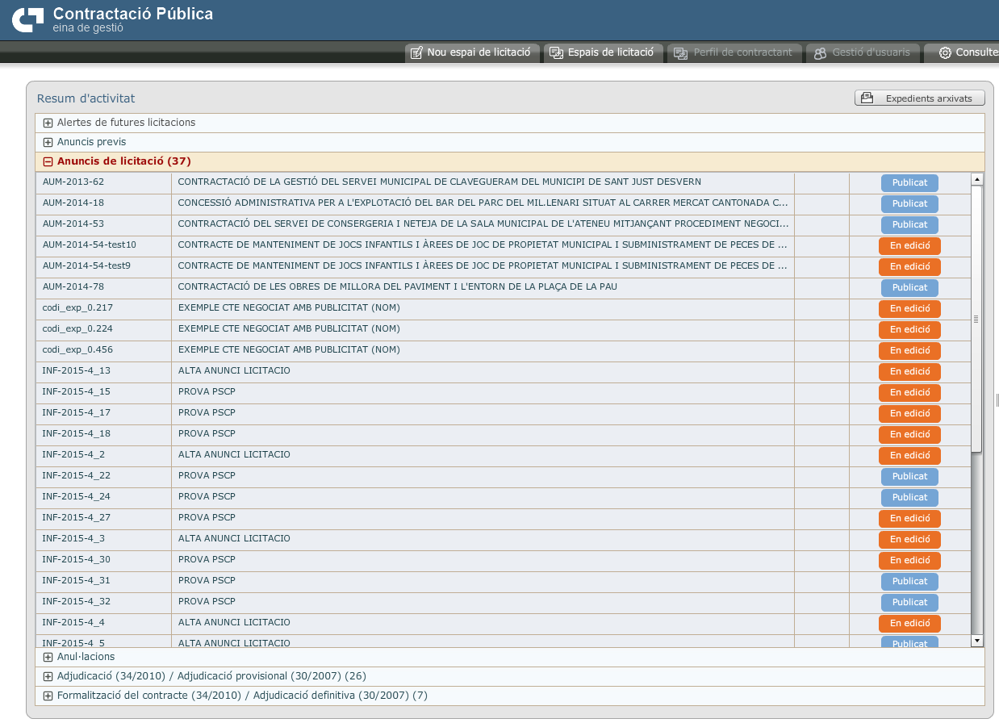
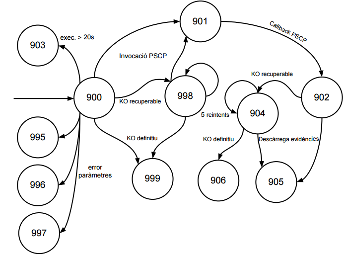
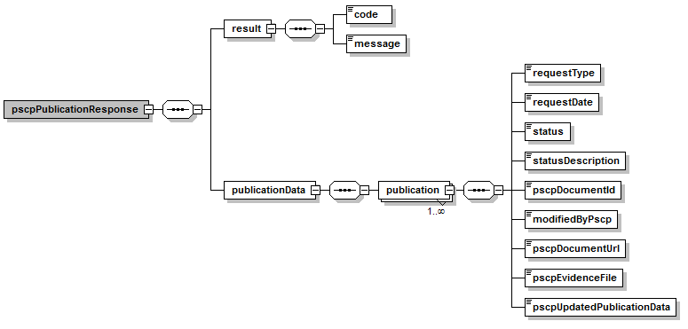
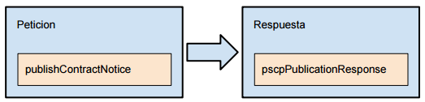
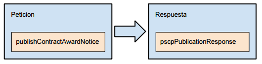
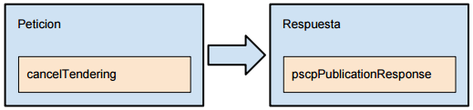
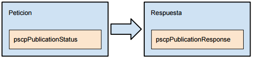

# Plataforma de Serveis de Contractació Pública de la Generalitat - PSCP(integració via PCI)

# **Document d&#39;integració del servei**


**Històric de revisions**

| **Versió** | **Data** | **Autor** | **Comentaris** |
| --- | --- | --- | --- |
| V2.0 | 21/08/2015 | Òscar Trapote | Creació del document |

# Índex

1. [1 Introducció](#1)
2. [2 Transmissions de dades disponibles](#2)
3. [3 Funcionament del servei](#3)
	1.  [3.1 Enviament d'actuacions a la PSCP](#3.1)
	2.	[3.2 Consulta de les actuacions associades a un expedient](#3.2)
4. [4 Estats del servei – codis d&#39;error](#4)
5. [5 Missatgeria dels serveis](#5)
	1.	[5.1 Dades genèriques a la petició PCI](#5.1)
	2.	[5.2 Resposta – dades específiques](#5.2)
	3.	[5.3 Petició - publicació d&#39;un anunci de licitació](#5.3)
		1.  [5.3.1 Dades específiques](#5.3.1)
	4.	[5.4 Petició - publicació d&#39;una adjudicació de contracte](#5.4)
		1. [5.4.1 Dades específiques](#5.4.1)
	5.  [5.5 Petició - publicació d&#39;una cancel·lació de contracte](#5.5)
		1. [5.5.1 Dades específiques](#5.5.1)
	6.  [5.6 Petició – consulta de l&#39;estat d&#39;un expedient (publicacions)](#5.6)
		1. [5.6.1 Dades específiques](#5.6.1)
	7.	[5.7 Taules codificadores generals](#5.7)


# 1 Introducció <a name="1"></a>

Aquest document detalla el procediment d&#39;us del producte d&#39;interopreabilitat amb la PSCP (Plataforma de Serveis de Contractació Pública) a través de la plataforma PCI.

Per poder realitzar la integració cal conèixer prèviament la següent documentació:

- [Document de Missatgeria Genèrica de la PCI del Consorci AOC.][PCI]
- [Manual d&#39;integració de la PSCP][PSCP]

[PSCP]:https://github.com/ConsorciAOC/PSCP/tree/main/Manual%20d'integraci%C3%B3%20PSCP


[PCI]:https://github.com/ConsorciAOC/PCI

# 2 Transmissions de dades disponibles <a name="2"></a>

Les dades disponibles a través del servei són les que es presenten a continuació:

| **EMISSOR** |
| --- |
| Consorci Administració Oberta Catalunya |

| **PRODUCTE (CodigoProducto)** |**MODALITAT (CodigoCertificado)** | **DESCRIPCIO** |
| --- | --- | --- |
| **PSCP** | PSCP | Aquesta modalitat permet realitzar totes les operacions disponibles a a la PSCP.<br><br>En funció del tipus de missatge es pot realitzar qualsevol de les següents operacions:<br><br><li> Publicació d&#39;un anunci de licitació.<li> Publicació d&#39;una adjudicació de contracte.<li> Cancel·lació d&#39;una licitació o adjudicació.<li> Esmenes sobre les publicacions ja enviades a PSCP.<li> Consulta de l&#39;estat de les publicacions associades a un expedient. |

**(Correspondència amb missatgeria PCI)**


**FINALITATS**


| **MODALITAT** | **PREPRODUCCIÓ** | **PRODUCCIÓ** |
| --- | --- | --- |
| PSCP | PROVES | - |

# 3 Funcionament del servei <a name="3"></a>

Els casos d&#39;us del servei s&#39;ilustren al següent gràfic:



Aquests casos d&#39;ús son els següents:

- Enviament d&#39;una actuació a la PSCP [licitació, adjudicació i cancel·lació]
- Consulta de l&#39;estat de les actuacions associades a un expedient
 
## 3.1 Enviament d&#39;actuacions a la PSCP <a name="3.1"></a>

Quan es vol realitzar una actuació a la PSCP s&#39;ha d&#39;enviar dins del bloc de missatgeria específica de la petició PCI un missatge de tipus _publishContract_, _publishContractAward_ o _cancelTendering_, tots ells definits al manual d&#39;integració de la PSCP.

En el cas de que la petició tingui documentació annexada, caldrà enviar-la mitjançant el bloc _Ficheros_ de la missatgeria PCI, emprant la optimització MTOM/XOP.

Per relacionar els fitxers adjunts a la petició PCI amb la actuació a la PSCP s&#39;usarà el hash MD5 del contingut de cada document annexat. Per exemple, si tenim el següent bloc _Ficheros_ a una petició PCI

```
<pet:Ficheros>
          <pet:Fichero>
            <pet:NombreFichero>fitxer-prova.doc</pet:NombreFichero>
            <pet:Contenido>--contingut optimitzat MTOM/XOP--</pet:Contenido>
            <pet:Id>9359226c46914cb2fc10c786e4c8e7c7</pet:Id>
            <pet:Via>Entrada</pet:Via>
          </pet:Fichero>

```

Haurem de trobar el mateix identificador al bloc _WSDocumentReference_ de la petició específica PSCP.

```
              <ent:WSDocumentReference>
                <ent:fileName>fitxer-prova.doc</ent:fileName>
                <ent:fileURI>9359226c46914cb2fc10c786e4c8e7c7</ent:fileURI>
                <ent:type>1</ent:type>
              </ent:WSDocumentReference>

```

Així doncs, en el moment de realitzar la transferencia dels fitxers adjunts cap a la PSCP, el servei cercarà el contingut del document mitjançant l&#39;ús de la clau _fileURI_, que a l&#39;exemple té el valor &#39;9359226c46914cb2fc10c786e4c8e7c7&#39;.

Un cop llançada la petició el servei intentarà realitzar totes les passes necessàries de manera síncrona, retornant així un resultat de manera immediata.

Pot ser però -si els documents adjunts tenen un volum molt gran o si hi ha molta càrrega als sistemes- que aquesta execució síncrona no es pugui dur a terme en un temps raonable. En el cas d&#39;aquest servei, es considera que un temps raonable és com a molt 20 segons, entre càrrega de documentació adjunta (si n&#39;hi ha) i invocació dels serveis web de PSCP.

Passat aquest temps es retornara un codi de resultat que indica que la petició passa a executar-se de manera asíncrona i que caldrà consultar el seu estat mitjançant una operació que descriurem a continuació.

## 3.2 Consulta de les actuacions associades a un expedient <a name="3.2"></a>

La natura de la PSCP és asincrona. Després de realitzar qualsevol actuació amb èxit aquesta queda marcada com a &#39;_en edició_&#39; i és imprescindible entrar al portal web de PSCP per a revisar i aprovar la actuació (ja sigui publicació, adjudicació o cancel·lació).



Un cop realitzada aquesta validació manual, PSCP acaba realitzant l&#39;acte de publicació en la data especificada a la pròpia actuació. Quan aquesta publicació es fa efectiva PSCP envia una crida als nostres sistemes per informar-ne.

Aquesta crida desencadena la descàrrega del fitxer amb les evidències de l&#39;acte de publicació. Si aquesta descàrrega finalitza amb èxit és quan la actuació es dona per finalitzada.

Per invocar la operació de consulta de l&#39;estat de les actuacions d&#39;un expedient s&#39;ha d&#39;enviar dins del bloc de missatgeria específica de la petició PCI un missatge de tipus _pscpPublicationStatus. A_questa operació pot ser usada en qualsevol moment per a coneixer l&#39;estat en el que es troben les diferents actuacions sobre un expedient.

Per últim, indicar que les actuacions contra un expedient son acumulatives, és a dir, es poden fer diverses comunicacions del mateix tipus sobre un expedient per poder corregir dades incorrectes o afegir-hi dades mancants. El sistema emmagatzema totes les actuacions realitzades i les retorna ordenades cronològicament en sentit descendent (de més recent a menys recent).

La publicació vigent serà la més recent de cada tipus, per exemple, si s&#39;envien tres actuacions de publicació d&#39;anunci de licitació, la darrera serà la que finalment a aportat totes les dades necessàries i serà la que PSCP acabarà publicant.

# 4 Estats del servei – codis d&#39;error <a name="4"></a>

Donada la natura asíncrona del servei de publicació a la PSCP i a algunes de les tasques que implica la publicació -com poden ser la pujada de fitxers adjunts cap a un servidor SFTP o la descàrrega de fitxers d&#39;evidències des de la PSCP- el servei implementa la següent màquina d&#39;estats.



Cada estat té un codi que és retornat com a resultat a la resposta. La descripció dels estats es llista a continuació:

| Codi | Descripció |
| --- | --- |
| 900 | La petició ha estat enregistrada a la base de dades del servei però encara no ha estat enviada cap a la PSCP. |
| 901 | La petició ha estat lliurada i acceptada per la PSCP. Això vol dir que la publicació queda pendent de revisió i aprovació manual per part d&#39;un usuari al portal web de PSCP. Quan l&#39;anunci quedi definitivament publicat el servei rebrà un callback des de PSCP amb el fitxer de les evidencies de publicació. |
| 902 | El anunci ha estat publicat definitivament a la PSCP i s&#39;ha rebut el callback amb les dades de les evidències però encara no ha estat possible descarregar el fitxer des de la seva ubicació remota. |
| 903 | Aquest resultat només es donarà quan l&#39;enviament de la publicació cap a la PSCP trigui més de 20 segons. Aquesta situació es pot donar en publicacions que tinguin adjunts de volum elevat o en dies en els que la càrrega de la PSCP sigui molt elevada i aquesta trigui en respondre. |
| 904 | Aquest resultat indica que el sistema està intentant descarregar el fitxers amb les evidències de publicació a la PSCP. Aquest resultat només es pot donar en crides de consulta de l&#39;estat de les publicacions, donat que la descàrrega d&#39;evidències és una de les darreres tasques que es realitzen en el cicle de vida d&#39;una publicació. |
| 905 | Aquest resultat indica que la publicació ha estat finalitzada amb èxit. És a dir:<br><br><li>La publicació ha estat enviada amb èxit a la PSCP.<li>La publicació ha estat aprovada per un usuari al portal web de la PSCP.<li>La PSCP ha fet efectiva la publicació i ha enviat el callback al nostre sistema.<li>El sistema ha pogut descarregar el fitxer d&#39;evidències amb èxit. |
| 906 | Aquest resultat indica que la publicació ha estat finalitzada amb èxit, però no s&#39;ha pogut fer la descàrrega del fitxer d&#39;evidències i s&#39;han exhaurit el nombre màxim d&#39;intents. En aquest cas caldrà contactar el servei de suport per a trobar el motiu pel qual no s&#39;ha pogut realitzar la descàrrega i fer-la, ja sigui rellançant el procés de descàrrega o manualment. |
| 999 | Aquest resultat indica que s&#39;ha produït un error irrecuperable que impedeix que la publicació segueixi endavant. S&#39;enten per error irrecuperable un error tècnic que impedeix el tractament normal d&#39;una publicació o un error recuperable que s&#39;ha produït de manera reiterada i per al qual s&#39;ha esgotat el nombre màxim de reintents. |
| 998 | Aquest resultat indica que s&#39;ha produït un error recuperable. L&#39;estat de la publicació canviarà donat que el sistema intentarà re-executar la petició.En el cas en que l&#39;error persisteixi i s&#39;esgotin els intents màxims establerts, la publicació passarà a tenir el codi de resultat 999. |
| 995 | Aquest resultat indica que hi ha dades de fitxers adjunts a la petició PSCP que no tenen el seu bloc de fitxer adjunt corresponent a la petició PCI, és a dir, hi ha un identificador (hash md5) al camp _fileURI_ que no té un bloc _Fichero_ a la petició PCI amb camp _Id_ amb el mateix valor. |
| 996 | Aquest resultat indica que el camp _publisherId_ no ha estat informat a la petició. És obligatori informar el codi de publicador, donat que indica l&#39;usuari de la plataforma PSCP i per tant té associats tant l&#39;organisme per al qual es fa la publicació com els permisos. |
| 997 | Aquest resultat indica que el camp _diligenceId_ (codi d&#39;expedient) no ha estat informat a la petició. |

Apart d&#39;aquests codis de resultat, es traslladen a l&#39;integrador els codis d&#39;error de negoci de la pròpia PSCP.

A continuació es mostra la taula de codis d&#39;error extreta del manual d&#39;integració de PSCP.

| **Codi** | **Descripció** |
| --- | --- |
| | Correspon a una comunicació sense CDA entre el backoffice extern i Plataforma |
| 025 | Pot tenir aquests causes:<ol><li value="1">No s&#39;ha especificat un codiBE, o no es vàlid.</li><li value="2">El codiBE es vàlid, però el CDA de la signatura del missatge SOAP i el CDA importat a PSCP i associat al codiBE, no coincideixen.</li></ol> |
| 026 | Correspon a una comunicació per part d&#39;un òrgan del backoffice extern quan no s&#39;ha habilitat el permís corresponent a la Plataforma per aquell òrgan |
| 027 | Correspon a una comunicació per part d&#39;un òrgan del backoffice extern quan no s&#39;ha donat d&#39;alta l&#39;usuari el NIF del qual s&#39;envia com a paràmetre de la crida, o el Nif no està vinculat a l&#39;òrgan de contractació |
| 010 | Correspon a una comunicació per part d&#39;un òrgan del backoffice extern quan no s&#39;ha donat d&#39;alta a la Plataforma aquell òrgan |
| 022 | Es produeix quan l&#39;objecte de la comunicació és enviar una _anul·lació_ corresponent a un expedient que encara no s&#39;ha creat a la Plataforma |
| 562 | Es produeix quan l&#39;objecte de la comunicació és enviar una AL i la fase actual de l&#39;expedient és _d&#39;anunci de licitació_ amb estat publicat, però encara no és visible. |
| 003 | Es produeix quan l&#39;objecte de la comunicació és enviar una _AL_ i la fase actual de l&#39;expedient a la Plataforma és la d&#39;_Anul·lació_ |
| 001 | Es produeix quan l&#39;objecte de la comunicació és enviar una _AL_ i la fase actual de l&#39;expedient a la Plataforma és la d&#39;_Adjudicació_ |
| 001 | Es produeix quan l&#39;objecte de la comunicació és enviar una _AL_ i la fase actual de l&#39;expedient a la Plataforma és la de FORMALITZACIO |
| 003 | Es produeix quan l&#39;objecte de la comunicació és enviar una ADJUDICACIO i la fase actual de l&#39;expedient és la de _anul·lació._ |
| | Es produeix quan l&#39;objecte de la comunicació és enviar una ADJUDICACIO i la fase actual de l&#39;expedient és _de adjudicació_ amb estat publicat, però encara no és visible. |
| 002 | Es produeix quan l&#39;objecte de la comunicació és enviar una ADJUDICACIO i la fase actual de l&#39;expedient és la de FORMALITZACIO |
| 564 | Es produeix quan l&#39;objecte de la comunicació és enviar una FORMALITZACIO i **no existeix**** ADJUDICACIO no deserta publicada i visible.** |
| 563 | Es produeix quan l&#39;objecte de la comunicació és enviar una FORMALITZACIO i la fase actual de l&#39;expedient és FORMALITZACIO amb estat publicat, però encara no és visible. |
| 561 | Es produeix quan l&#39;objecte de la comunicació és enviar una _anul·lació_ i la fase actual de l&#39;expedient és la d&#39;_anunci de licitació,_ i el seu estat és diferent al de _publicat i visible_. |
| 003 | Es produeix quan l&#39;objecte de la comunicació és enviar una _anul·lació_ i la fase actual de l&#39;expedient és la d&#39;_anul·lació,_ i el seu estat és el de _publicat._ |
| 022 | Es produeix quan l&#39;objecte de la comunicació és enviar una _anul·lació_ i la fase actual de l&#39;expedient és d&#39;_ADJUDICACIÓ_ |
| 022 | Es produeix quan l&#39;objecte de la comunicació és enviar una _anul·lació_ i la fase actual de l&#39;expedient és la de FORMALITZACIO |
| | **Dates de publicació** |
| 013 | Es produeix quan la _data de publicació de l&#39;Adjudicació_ és inferior o igual a la data de publicació de l&#39;anunci de licitació. |
| 014 | Es produeix quan la _data de publicació de_ FORMALITZACIO és inferior o igual a la data de publicació de l&#39;Adjudicació |
| |  **Tipus de contracte** |
| 404 | Es produeix quan el tipus de procediment és _contracte menor_ i es comunica que es tracta d&#39;un acord marc. |
| 404 | Es produeix quan es comunica que el procediment és un _acord marc_, i el tipus de procediment és un _contracte derivat d&#39;acord marc_. |
| 404 | Es produeix quan el tipus de procediment és un _contracte menor_ i el tipus de contracteés &#39;Gestió de serveis públics&#39;, &#39;col·laboració públic-privat&#39;, &#39;concessió d&#39;obra pública&#39;. |
| **Codi** | **Descripció** |
| 009 | Es produeix si no es comunica el codi identificador de l&#39;expedient. |
| 005 | Es produeix si no es comunica el tipus d&#39;expedient. |
| 007 | Es produeix si no es comunica el tipus de procediment. |
| 006 | Es produeix si no es comunica el tipus de contracte. |
| 008 | Es produeix si no es comunica el nom del contracte. |
| 028 | Es produeix si no es comunica el codi de l&#39;òrgan de contractació. |
| 572 | Es produeix si no es comunica l&#39;identificador o la descripció d&#39;un lot en un anunci de licitació, adjudicació o formalització amb lots informats |
| 572 | Es produeix si no es comuniquen els codis CPV en un anunci de licitació amb lots informats. |
| 571 | Es produeix si l&#39;objecte de comunicació és una adjudicació no deserta i no es comunica l&#39;empresa |
| 571 | Es produeix si l&#39;objecte de comunicació és una adjudicació no deserta i no es comunica la nacionalitat de l&#39;empresa. |
| **Codi** | **Descripció** |
| 009 | Es produeix quan el codi d&#39;expedient no és vàlid. |
| 011 | Es produeix si la data de publicació pertany al passat. |
| 029 | Es produeix si el codi de l&#39;òrgan de contractació no és vàlid. |
| 016 | Es produeix si el certificat de la signatura no es correspon amb la llista de sistemes admesos. |
| 017 | Es produeix si no es reconeix la CA del certificat com a entitat de confiança. |
| 018 | Es produeix si no es troba un arxiu annex |
| 019 | Es produeix si un arxiu annex no coincideix amb el HASH informat a l&#39;anunci. |
| 020 | Es produeix si l&#39;arxiu adjunt és massa gran (max 20 M, o s&#39;adjunten més arxius dels permesos (10) |
| 021 | Es produeix si l&#39;arxiu adjunt no és d&#39;un tipus permès: .PDF,.DOC,.ZIP,.RAR,.PPT,.XLS,.JPG,.JPEG,.PNG,.TIFF,.TIF, XLSX, DOCX, PPTX |
| 024 | Es produeix quan l&#39;objecte de comunicació és un AL d&#39;un expedient amb lots, la fase actual de l&#39;expedient és la _d&#39;anunci de licitació_ i el nombre de subprocuringprojects no coincideix amb el nombre de lots informats. |
| 568 | Es produeix quan l&#39;objecte de la comunicació és una _adjudicació_ d&#39;un expedient amb lots, la fase actual de l&#39;expedient és la _d&#39;anunci de licitació_ i el nombre de TR no coincideix amb el nombre de lots introduïts a l&#39;anunci de licitació. |
| 565 | Es produeix quan l&#39;objecte de la comunicació és una _Formalització_ d&#39;un expedient amb lots, i algun dels lots rebut és desert. |
| 568 | Es produeix quan l&#39;objecte de la comunicació és una _adjudicació_ i existeix un _anunci de licitació_ amb lots informats. Es considera error si els camps identificador del lot i descripció del lot no coincideixen. |
| 568 | Es produeix quan l&#39;objecte de la comunicació és una _Formalització_ i existeix una _adjudicació_ amb lots informats. Es considera error si els camps identificador de lot i descripció de lot no coincideixen. |
| 556 | Es produeix quan l&#39;objecte de comunicació és un _anunci de licitació_ i el nombre de plecs tècnics és superior a un. |
| 556 | Es produeix quan l&#39;objecte de comunicació és un _anunci de licitació_ i el nombre de plecs administratius és superior a un. |
| 452 | Es produeix quan l&#39;objecte de comunicació inclou alhora les dades de _Duració del contracte_ i de _termini d&#39;execució._ Aquesta validació també es fa en cas d&#39;informar les dades dels lots. |
| 566 | Es produeix quan l&#39;objecte de comunicació és una _anul·lació_ i el valor de ResultCode corresponent al TenderResult és diferent de _Renúncia o Desistiment._ |
| 566 | Es produeix quan l&#39;objecte de comunicació és una _adjudicació_ i el valor de ResultCode corresponent al TenderResult és diferent a _adjudicació adjudicada o deserta_ |
| 566 | Es produeix quan l&#39;objecte de comunicació és _una Formalització_ i el valor de ResultCode corresponent al TenderResult és _desert._ |
| 567 | Es produeix quan l&#39;objecte de comunicació és una _adjudicació deserta,_ i s&#39;informen els camps d&#39;empresa, nacionalitat de l&#39;empresa. |
| 550 | Es produeix quan l&#39;objecte de comunicació és un _anunci de licitació_ i s&#39;informen alhora que preu com a criteri únic d&#39;adjudicació i altres criteris d&#39;adjudicació. |
| 576 | Es produeix si el identificador del lot no és numèric. |
| 577 | Es produeix quan en un camp de transparència s&#39;informa d&#39;una anotació superior als 255 caràcters |
| 578 | Es produeix quan s&#39;activa sobre digital i presentació d&#39;ofertes telemàtica a la vegada |
| 579 | Es produeix si informen d&#39;un nom de fitxer superior a 255 caràcters |
| 580 | Es produeix si la longitud del codi d&#39;expedient és superior a 50 caràcters |
| 581 | Es produeix si s&#39;envia una cancel·lació en un anunci de licitació que no està publicat |
| 582 | Es produeix si el nombre d&#39;ofertes en la fase adjudicació és incorrecte:<li> En adjudicacions desertes si no és més gran o igual a 0 i inferior a 999.<li> En adjudicacions no desertes i no és més gran o igual a 1 i inferior a 999. |
| 583 | Es produeix quan la descripció de la prestació és superior a 4.000 caràcters |
| **Codi** | **Descripció** |
| 1000 | Es produeix si no s&#39;informa el subtipus de contracte |
| 1001 | Es produeix si el subtipus de contracte no és correcte pel tipus de contracte informat |
| 1002 | Es produeix si no s&#39;ha informat ni la durada del contracte o ni del termini d&#39;execució |
| 1003 | Es produeix si no s&#39;ha informat el valor estimat del contracte |
| 1004 | Es produeix si no s&#39;ha informat el pressupost de licitació |
| 1005 | Es produeix si no s&#39;ha informat pressupost de licitació no és correcte (no pot ser negatiu i superior a 9 xifres) |
| 1006 | Es produeix si no s&#39;ha informat el lloc d&#39;execució |
| 1007 | Es produeix si no s&#39;ha informat del termini de presentació d&#39;ofertes |
| 1008 | Es produeix si no s&#39;ha informat els plecs administratius. |
| 1009 | Es produeix si no s&#39;ha informat el camp compra innovadora |
| 1010 | Es produeix si no s&#39;ha informat un codi CPV correcte |
| 1011 | Es produeix si no s&#39;ha informat el codi CPV correcte en un lot |
| 1012 | Es produeix si no s&#39;ha informat la data d&#39;adjudicació |
| 1013 | Es produeix si no s&#39;ha informat del termini de formalització del contracte en un lot |
| 1014 | Es produeix en un enviament d&#39;un camp de transparència a on s&#39;ha indicat que és de tipus anotació i no s&#39;ha informat correctament |
| 1015 | Es produeix en un enviament d&#39;un camp de transparència a on s&#39;ha indicat de tipus URL i no s&#39;ha informat aquesta |
| 1016 | Es produeix en un enviament d&#39;un camp de transparència a on s&#39;ha indicat la URL i el tipus de documentació no admet URL |
| 1017 | Es produeix en un enviament d&#39;un camp de transparència exclusiu dels expedients de tipus &quot;Concessió d&#39;obres públiques&quot; o &quot;Gestió de serveis&quot; en un expedient que no és d&#39;aquest tipus. |
| 1018 | Es produeix si la URL del formulari de queixes de transparència no és vàlida |
| 1019 | Es produeix en el cas que es marqui l&#39;expedient d&#39;accés exclusiu i no és: &quot;Sense publicitat&quot;, &quot;Contracte menor&quot;, &quot;Contracte derivat acord marc&quot; o &quot;Altres procediments segons instruccions internes&quot; |
| 1020 | Es produeix si el tipus de solvència financera no és vàlid |
| 1021 | Es produeix si el tipus del criteri de solvència no està definit |
| 1022 | Es produeix si el tipus per la solvència tècnica no és vàlid |
| 1023 | Es produeix si la descripció del criteri de solvència és buida |
| 1024 | Es produeix si la quantitat del criteri no és numèric i positiu |
| 1025 | Es produeix si en una adjudicació no deserta no s&#39;hi indica el tipus d&#39;adjudicatari |
| 1026 | Es produeix si l&#39;identificador de l&#39;adjudicatari no és correcte |
| 1027 | Es produeix en el cas que l&#39;import d&#39;adjudicació amb IVA és negatiu |
| 1028 | Es produeix en el cas que l&#39;import d&#39;adjudicació sense IVA és negatiu |
| 1029 | Es produeix en l&#39;enviament d&#39;empreses convidades i l&#39;identificador de l&#39;empresa no està definit (CIF/NIF o NIE). |
| 1030 | Es produeix en l&#39;enviament d&#39;empreses convidades i el nom de l&#39;empresa no està definit. |
| 1031 | Es produeix en l&#39;enviament d&#39;empreses convidades i han entrat un correu electrònic incorrecte. |
| 1032 | Es produeix en l&#39;enviament d&#39;empreses convidades i l&#39;identificador de l&#39;empresa és invàlid (CIF/NIF o NIE). |
| 1033 | Es produeix si el lloc d&#39;execució d&#39;un lot no és correcte (codi INE incorrecte) |
| 1034 | Es produeix si informen el correu electrònic de recepció d&#39;ofertes i l&#39;expedient no és ni de tipus presentació ofertes telemàtiques ni sobre digital |
| 1035 | Es produeix si la descripció del lot no coincideix amb la de la fase anterior |
| 1036 | Es produeix si no s&#39;ha informat d&#39;un camp de transparència obligatori |
| 1037 | Es produeix en el cas que s&#39;enviï un document de transparència en una fase que no està requerit |
| 1038 | Es produeix quan el termini de presentació d&#39;ofertes és superior a la data de publicació |
| 1039 | Es produeix si no s&#39;envien els plecs administratius |
| 1040 | Es produeix si da descripció de la prestació no conté un mínim del 60% del text escrit en minúscules |
| 1041 | Es produeix si no s&#39;informa el número d&#39;ofertes rebudes |
| 1042 | Es produeix si no s&#39;informa el número d&#39;ofertes rebudes en un lot |
| 1043 | Es produeix si en una fase final (adjudicació deserta, formalització o anul·lació) la data de fi de publicació no és com a mínim a 5 anys superior a la data de publicació |
| 1044 | Es produeix si no s&#39;ha informat de la data d&#39;adjudicació del contracte en un lot |

# 5 Missatgeria dels serveis <a name="5"></a>

A continuació es detalla la missatgeria corresponent al bloc de dades específiques de les modalitats de consum del producte PSCP.

## 5.1 Dades genèriques a la petició PCI <a name="5.1"></a>

En el cas d&#39;enviament de documents adjunts caldrà informar les dades dels documents dins del bloc

---
/Peticion/Solicitudes/SolicitudTransmision[1]/DatosGenericos/Ficheros

---

```
      <pet:DatosGenericos>
	<pet:Emisor>
		<pet:NifEmisor>${nifEmissor}</pet:NifEmisor>
		<pet:NombreEmisor>${nomEmissor}</pet:NombreEmisor>
	</pet:Emisor>
	<pet:Solicitante>
		<pet:IdentificadorSolicitante>${idSolicitant}</pet:IdentificadorSolicitante>
		<pet:NombreSolicitante>${nomSolicitant}</pet:NombreSolicitante>
		<pet:Finalidad>PROVES</pet:Finalidad>
		<pet:Consentimiento>Si</pet:Consentimiento>
		<pet:Funcionario>
			<pet:NombreCompletoFuncionario>${nomFuncionai}</pet:NombreCompletoFuncionario>
			<pet:NifFuncionario>${nifFuncionari}</pet:NifFuncionario>
			<pet:EMailFuncionario>${emailFuncionari}</pet:EMailFuncionario>
		</pet:Funcionario>
	</pet:Solicitante>
	<pet:Transmision>
		<pet:CodigoCertificado>PSCP</pet:CodigoCertificado>
		<pet:IdSolicitud>1</pet:IdSolicitud>
		<pet:IdTransmision>${idTransmissio}</pet:IdTransmision>
	</pet:Transmision>
	<pet:Ficheros>
		<pet:Fichero>
			<pet:NombreFichero>fitxer-prova.doc</pet:NombreFichero>
			<pet:Contenido>cid:123456789R</pet:Contenido>
			<pet:Id>9359226c46914cb2fc10c786e4c8e7c7</pet:Id>
			<pet:Via>Entrada</pet:Via>
		</pet:Fichero>
	</pet:Ficheros>
</pet:DatosGenericos>

```

Les dades obligatòries son :

- _NombreFichero_ : Nom del fitxer. El nom ha de coincidir amb el que s&#39;informarà a la petició específica PSCP.

- _Contenido_ : Obligatori només en el cas en que l&#39;enviament dels documents es realitzi mitjançant optimització MTOM/XOP. Aquest camp contindrà el punter cap a la part MIME del missatge de petició que arrossega el contingut (els clients WS actuals ja fan tot el tractament de manera trasparent).

- _RutaFichero_ : Obligatori només en el cas en que l&#39;enviament dels documents adjunts es realitzi deixant-los als nostres servidors SFTP abans de fer la invocació del servei web. La ruta haurà de ser absoluta respecte al servidor SFTP. Es recomana però, emprar el mecanisme MTOM/XOP donat que és òptim pel que fa a rendiment.

- _Id_ : Aquest camp identifica el fitxer i el relaciona amb la petició específica PSCP. Obligatòriament, aquest identificador ha de ser el hash MD5 del contingut del fitxer en representació hexadecimal i amb les lletres en minúscules.<ul><br>9359226c46914cb2fc10c786e4c8e7c7 és un identificador vàlid<br>9359226C46914CB2FC10C786E4C8E7C7 és un identificador invàlid</ul>

## 5.2 Resposta – dades específiques <a name="5.2"></a>

Totes les operacions tenen com a resposta el següent missatge:



La resposta conté un codi de resultat general que correspon a la pròpia operació i una sèrie de resultats que es corresponen amb cadascuna de les accions realitzades sobre l&#39;&#39;expedient.

| _Atributs_ | _Descripció_ |
| --- | --- |
| /pscpPublicationResponse/result/code | Codi de resultat de la operació de consulta. Pot tenir com a valors possibles &#39;OK&#39; o, en cas d&#39;error, el codi d&#39;error corresponent [veure taula de codis d&#39;error]. |
| /pscpPublicationResponse/result/message | Descripció del resultat. Per exemple, si el codi d&#39;expedient no es troba registrat al sistema o si hi ha hagut un problema tècnic. |
| /psc...nse/publicationData/publication | Dades d&#39;una acció (publicació). |
| //publicationData/publication/requestType | Tipus d&#39;acció. Aquestes accions es corresponen amb els tipus de missatge que es poden enviar cap a la PSCP.<br>Els tres valors possibles son:<br><li>TENDERING per a licitacions.<li>AWARDING per a adjudicacions.<li>CANCEL per a cancel·lacions de contractes. |
| //publicationData/publication/requestDate | Conté la data en la que la petició va entrar al sistema. Les publicacions es llisten en ordre cronològic descendent (de més recent a menys recent). |
| //publicationData/publication/status | Estat en el que es troba la publicació. Aquest codi d&#39;estat pot tenir els valors descrits a l&#39;apartat 4 d&#39;aquest document. |
| //publicationData/publication/statusDescription | Descripció de l&#39;estat. En cas d&#39;error dona informació precisa sobre el motiu d&#39;aquest. |
| //publicationData/publication/pscpDocumentId | En el cas de que la publicació arribi a registrar-se a la PSCP, aquest camp conté el seu identificador únic de publicació. |
| //publicationData/publication/modifiedByPscp | Aquest camp indica si l&#39;anunci ha patit modificacions fetes des del portal web. |
| //publicationData/publication/pscpDocumentUrl | Aquest camp conté la URL a la qual l&#39;anunci serà accessible si aquest arriba a ser publicat finalment. |
| //publicationData/publication/pscpEvidenceFile | Aquest camp conté el fitxer ZIP amb les evidencies de publicació de l&#39;anunci a la PSCP si aquesta rriba finalment a publicar-se. |
| //publicationData/publication/pscpUpdatedPublicationData | Aquest camp conté les dades de la publicació (XML) tal qual es trobes a la PSCP. Si l&#39;indicador _modifiedByPscp_ te valor &#39;cert&#39; llavors probablement aquestes dades seran diferents a les que l&#39;integrador ha enviat en el moment de crear la publicació. |

El missatge de resposta ha estat creat en anglès en concordància amb la llengüa emprada per la plataforma PSCP, de manera que tota la missatgeria específica està en el mateix idioma.

A continuació es mostra un exemple de resposta:

```
<ns4:pscpPublicationResponsexmlns:ns4="http://cat.aoc/pscp">
	<ns4:result>
		<ns4:code>OK</ns4:code>
		<ns4:message>Dades obtingudes amb èxit.</ns4:message>
	</ns4:result>
	<ns4:publicationData>
		<ns4:publication>
			<ns4:requestType>AWARDING</ns4:requestType>
			<ns4:requestDate>2015-08-21T08:24:38.575+02:00</ns4:requestDate>
			<ns4:status>901</ns4:status>
			<ns4:statusDescription>La petició ha estat rebuda ...rtal web.</ns4:statusDescription>
			<ns4:pscpDocumentId>10928881</ns4:pscpDocumentId>
			<ns4:modifiedByPscp>false</ns4:modifiedByPscp>
			<ns4:pscpDocumentUrl>https://...;idDoc=10928881</ns4:pscpDocumentUrl>
		</ns4:publication>
		<ns4:publication>
			<ns4:requestType>AWARDING</ns4:requestType>
			<ns4:requestDate>2015-08-21T08:24:22.768+02:00</ns4:requestDate>
			<ns4:status>011</ns4:status>
			<ns4:statusDescription>Data de publicació pertany al passat.</ns4:statusDescription>
			<ns4:modifiedByPscp>false</ns4:modifiedByPscp>
		</ns4:publication>
		<ns4:publication>
			<ns4:requestType>TENDERING</ns4:requestType>
			<ns4:requestDate>2015-08-20T11:05:27.487+02:00</ns4:requestDate>
			<ns4:status>901</ns4:status>
			<ns4:statusDescription>La petició ha ...es del portal web.</ns4:statusDescription>
			<ns4:pscpDocumentId>10928638</ns4:pscpDocumentId>
			<ns4:modifiedByPscp>false</ns4:modifiedByPscp>
			<ns4:pscpDocumentUrl>https://...dDoc=10928638</ns4:pscpDocumentUrl>
		</ns4:publication>
		<ns4:publication>
			<ns4:requestType>TENDERING</ns4:requestType>
			<ns4:requestDate>2015-08-20T10:55:55.026+02:00</ns4:requestDate>
			<ns4:status>018</ns4:status>
			<ns4:statusDescription>No es troba un arxiu annex.</ns4:statusDescription>
			<ns4:modifiedByPscp>false</ns4:modifiedByPscp>
		</ns4:publication>
	</ns4:publicationData>
</ns4:pscpPublicationResponse>

```


Com es pot observar a l&#39;exemple hi ha quatre accions per a l&#39;expedient; les repassem de més antiga a més recent:

- La més antiga és el primer intent de publicació d&#39;anunci de licitació. Com es pot veure, no s&#39;envia el contingut del fitxer adjunt a la PSCP pel que la operacio falla amb codi 018 (&#39;No es troba fitxer adjunt&#39;, codi d&#39;error de negoci PSCP).
- La següent acció corregeix les dades de la acció anterior i es registra amb èxit a la PSCP. L&#39;estat de la petició queda a 901, es a dir, cal que un usuari realitzi la aprovació de l&#39;anunci des de la web de la PSCP per a que aquesta l&#39;acabi publicant.
- La següent acció és un intent de publicació d&#39;adjudicació de contracte per a l&#39;expedient. Com es pot veure, la data de publicació és anterior al moment de fer petició pel que aquesta finalitza amb estat 011 (&#39;Data de publicació pertany al passat&#39;, codi d&#39;error de negoci PSCP).
- La següent acció corregeix les dades de la acció anterior i es registra amb èxit a la PSCP. L&#39;estat de la petició queda a 901, es a dir, cal que un usuari realitzi la aprovació de l&#39;anunci des de la web de la PSCP per a que aquesta l&#39;acabi publicant.

## 5.3 Petició - publicació d&#39;un anunci de licitació <a name="5.3"></a>

Aquest cas d&#39;ús es donarà en el moment en que un gestor d&#39;expedients de contractació vulgui publicar un anunci de licitació a la platatorma PSCP de la Generalitat.



### 5.3.1 Dades específiques <a name="5.3.1"></a>

La petició especifica per a aquesta operació és un missatge de tipus _publishContractNotice_. Per a més referències, consulteu el manual d&#39;integració de la PSCP (versió 6.5).

A continuació es mostra un exemple de petició PCI amb les dades especifiques corresponents a aquest cas d&#39;us.


```
<pet:Peticion>
	<pet:Atributos>
		<pet:IdPeticion>${idPeticio}</pet:IdPeticion>
		<pet:NumElementos>1</pet:NumElementos>
		<pet:TimeStamp/>
		<pet:CodigoCertificado>PSCP</pet:CodigoCertificado>
		<pet:CodigoProducto>PSCP</pet:CodigoProducto>
		<pet:DatosAutorizacion>
			<pet:IdentificadorSolicitante>${idSolicitant}</pet:IdentificadorSolicitante>
			<pet:NombreSolicitante>${nomSolicitant}</pet:NombreSolicitante>
			<pet:Finalidad>PROVES</pet:Finalidad>
		</pet:DatosAutorizacion>
		<pet:Emisor>
			<pet:NifEmisor>${nifEmissor}</pet:NifEmisor>
			<pet:NombreEmisor>${nomEmissor}</pet:NombreEmisor>
		</pet:Emisor>
		<pet:Funcionario>
			<pet:NombreCompletoFuncionario>${nomFuncionai}</pet:NombreCompletoFuncionario>
			<pet:NifFuncionario>${nifFuncionari}</pet:NifFuncionario>
			<pet:EMailFuncionario>${emailFuncionari}</pet:EMailFuncionario>
		</pet:Funcionario>
	</pet:Atributos>
	<pet:Solicitudes>
		<pet:SolicitudTransmision>
			<pet:DatosGenericos>
				<pet:Emisor>
					<pet:NifEmisor>${nifEmissor}</pet:NifEmisor>
					<pet:NombreEmisor>${nomEmissor}</pet:NombreEmisor>
				</pet:Emisor>
				<pet:Solicitante>
					<pet:IdentificadorSolicitante>${idSolicitant}</pet:IdentificadorSolicitante>
					<pet:NombreSolicitante>${nomSolicitant}</pet:NombreSolicitante>
					<pet:Finalidad>PROVES</pet:Finalidad>
					<pet:Consentimiento>Si</pet:Consentimiento>
					<pet:Funcionario>
						<pet:NombreCompletoFuncionario>${nomFuncionai}</pet:NombreCompletoFuncionario>
						<pet:NifFuncionario>${nifFuncionari}</pet:NifFuncionario>
						<pet:EMailFuncionario>${emailFuncionari}</pet:EMailFuncionario>
					</pet:Funcionario>
				</pet:Solicitante>
				<pet:Transmision>
					<pet:CodigoCertificado>PSCP</pet:CodigoCertificado>
					<pet:IdSolicitud>1</pet:IdSolicitud>
					<pet:IdTransmision>${idTransmissio}</pet:IdTransmision>
				</pet:Transmision>
				<pet:Ficheros>
					<pet:Fichero>
						<pet:NombreFichero>fitxer-prova.doc</pet:NombreFichero>
						<pet:Contenido>cid:123456789R</pet:Contenido>
						<pet:Id>9359226c46914cb2fc10c786e4c8e7c7</pet:Id>
						<pet:Via>Entrada</pet:Via>
					</pet:Fichero>
				</pet:Ficheros>
			</pet:DatosGenericos>
			<pet:DatosEspecificos>
				<web:publishContractNotice>
					<web:in0>
						<ent:WSProcuringProject>
							<ent:subProcuringProjects>
								<ent:WSSubProcuringProject>
									<ent:WSClassificationCategory>
										<ent:WSClassificationCategory>
											<ent:codeValue>87654321-1</ent:codeValue>
											<ent:name>CPA</ent:name>
										</ent:WSClassificationCategory>
									</ent:WSClassificationCategory>
									<ent:classificationCategories>
										<ent:WSClassificationCategory>
											<ent:codeValue>70000000</ent:codeValue>
											<ent:name>CPV</ent:name>
										</ent:WSClassificationCategory>
									</ent:classificationCategories>
									<ent:description>descr</ent:description>
									<ent:id>1</ent:id>
									<ent:netBudgetAmount>3</ent:netBudgetAmount>
									<ent:totalBudgetAmount>1</ent:totalBudgetAmount>
									<ent:totalTaxAmount>1</ent:totalTaxAmount>
									<ent:resultCode>3</ent:resultCode>
									<ent:actualizationLocation>17</ent:actualizationLocation>
								</ent:WSSubProcuringProject>
								<ent:WSSubProcuringProject>
									<ent:WSClassificationCategory>
										<ent:WSClassificationCategory>
											<ent:codeValue>87654321-1</ent:codeValue>
											<ent:name>CPA</ent:name>
										</ent:WSClassificationCategory>
									</ent:WSClassificationCategory>
									<ent:classificationCategories>
										<ent:WSClassificationCategory>
											<ent:codeValue>70000000</ent:codeValue>
											<ent:name>CPV</ent:name>
										</ent:WSClassificationCategory>
									</ent:classificationCategories>
									<ent:description>descr</ent:description>
									<ent:id>2</ent:id>
									<ent:netBudgetAmount>3</ent:netBudgetAmount>
									<ent:totalBudgetAmount>1</ent:totalBudgetAmount>
									<ent:totalTaxAmount>1</ent:totalTaxAmount>
									<ent:resultCode>3</ent:resultCode>
									<ent:actualizationLocation>17</ent:actualizationLocation>
								</ent:WSSubProcuringProject>
							</ent:subProcuringProjects>
							<ent:actualizationLocation>17</ent:actualizationLocation>
							<ent:classificationCategories xsi:nil="true"/>
							<ent:contractExtensionOptionsDescription>....</ent:contract...
								<ent:contractName>nom</ent:contractName>
								<ent:contractingSystemTypeCode>0</ent:contractingSystemTypeCode>
								<ent:description>descripció</ent:description>
								<ent:estimateValueAmount>1000.0</ent:estimateValueAmount>
								<ent:id>01</ent:id>
								<ent:netBudgetAmount>1000.0</ent:netBudgetAmount>
								<ent:plannedPeriodDurationMeasure>200</ent:plannedPeriodDurationMeasure>
								<ent:totalBudgetAmount>1210.0</ent:totalBudgetAmount>
								<ent:totalTaxAmount>21.0</ent:totalTaxAmount>
								<ent:typeCode>31</ent:typeCode>
								<ent:variantsConstraintIndicator>0</ent:variantsConstraintIndicator>
							</ent:WSProcuringProject>
							<ent:WSTenderingProcess>
								<ent:auctionConstraintIndicator>0</ent:auctionConstraintIndicator>
								<ent:description>observacions</ent:description>
								<ent:diligenceTypeCode>1</ent:diligenceTypeCode>
								<ent:feeValueAmount>0.0</ent:feeValueAmount>
								<ent:openingTendersEventOcurrenceDate>2016-08-16T09:30:00</ent:opening....
									<ent:openingTendersEventOcurrenceLocation>BARCELONA</ent:opening..
										<ent:tendersReceptionPeriodEndDate>2016-08-16T09:30:00</ent:tenders...
											<ent:typeCode>4</ent:typeCode>
										</ent:WSTenderingProcess>
										<ent:WSTenderingTerms>
											<ent:WSAwardingCriteria>
												<ent:WSAwardingCriteria>
													<ent:description>descripcio</ent:description>
													<ent:weightNumeric>50.0</ent:weightNumeric>
												</ent:WSAwardingCriteria>
												<ent:WSAwardingCriteria>
													<ent:description>descripcio</ent:description>
													<ent:weightNumeric>50.0</ent:weightNumeric>
												</ent:WSAwardingCriteria>
											</ent:WSAwardingCriteria>
											<ent:additionalInformation>adicional</ent:additionalInformation>
											<ent:businessProfileClassificationCategory>36</ent:business...
												<ent:handicappedWorkersInidcator>0</ent:handicappedWorkersInidcator>
												<ent:limitationDescription>limitacio</ent:limitationDescription>
												<ent:maximumOperatorQuantity>6</ent:maximumOperatorQuantity>
												<ent:minimumOperatorQuantity>2</ent:minimumOperatorQuantity>
												<ent:protectedJobIndicator>0</ent:protectedJobIndicator>
												<ent:requiredClassification>
													<ent:financialEvaluationCriteriaDescription>01</ent:financia...
														<ent:financialEvaluationCriteriaThresholdQuantity>50.0</ent:financia...
															<ent:financialEvaluationCriteriaTypeCode>01</ent:financia...
																<ent:technicalEvaluationCriteriaDescription>01</ent:technica...
																	<ent:technicalEvaluationCriteriaThresholdQuantity>50.0</ent:technica...
																		<ent:technicalEvaluationCriteriaTypeCode>01</ent:technica...
																		</ent:requiredClassification>
																		<ent:requiredGuarantee>0</ent:requiredGuarantee>
																	</ent:WSTenderingTerms>
																	<ent:WSDocumentReference>
																		<ent:WSDocumentReference>
																			<ent:fileName>fitxer-prova.doc</ent:fileName>
																			<ent:fileURI>9359226c46914cb2fc10c786e4c8e7c7</ent:fileURI>
																			<ent:type>1</ent:type>
																		</ent:WSDocumentReference>
																	</ent:WSDocumentReference>
																	<ent:amendmentDescription/>
																	<ent:codiBE>${codiBE}</ent:codiBE>
																	<ent:contractingAuthorityPartySacId>${caPartySacId}</ent:contractin...
																		<ent:diligenceId>${idExpedient}</ent:diligenceId>
																		<ent:electronicDelivery>false</ent:electronicDelivery>
																		<ent:finalPlatformDate>2016-05-18T14:40:52</ent:finalPlatformDate>
																		<ent:issueDate>2015-08-22T11:10:00</ent:issueDate>
																		<ent:lotCount>2</ent:lotCount>
																		<ent:publishOnlyInPSCP>false</ent:publishOnlyInPSCP>
																		<ent:publisherId>${idPublicador}</ent:publisherId>
																	</web:in0>
																</web:publishContractNotice>
															</pet:DatosEspecificos>
														</pet:SolicitudTransmision>
													</pet:Solicitudes>
												</pet:Peticion>
												
```

---

 : Aquest exemple té únicament com a finalitat mostrar la estructura que ha de tenir una petició de publicació d&#39;anunci de licitació i en cap cas ha de ser près com a plantilla o model de petició. |

---


A l&#39;exemple es pot observar que hi ha un document adjunt, i que s&#39;està enviant el seu contingut mitjançant optimització MTOM/XOP (es pot veure la etiqueta –cid:123456789R– que serà substituïda pel punter xop en el moment de la transmissió). Tanmateix es pot observar que al camp _Id_ es troba el hash MD5 del contingut del document, i que a la petició específica s&#39;usa aquest mateix valor per a poder relacionar els dos conjunts de dades. A continuació es mostren els dos blocs; primer el bloc _Ficheros_ de la petició PCI:

```
<pet:Ficheros>
	<pet:Fichero>
		<pet:NombreFichero>fitxer-prova.doc</pet:NombreFichero>
		<pet:Contenido>cid:123456789R</pet:Contenido>
		<pet:Id>9359226c46914cb2fc10c786e4c8e7c7</pet:Id>
		<pet:Via>Entrada</pet:Via>
	</pet:Fichero>
	
```

I al bloc WSDocumentReference de la petició PSCP

```
<ent:WSDocumentReference>
	<ent:fileName>fitxer-prova.doc</ent:fileName>
	<ent:fileURI>9359226c46914cb2fc10c786e4c8e7c7</ent:fileURI>
	<ent:type>1</ent:type>
</ent:WSDocumentReference>

```

Així doncs, en el moment de realitzar la transferencia dels fitxers adjunts cap a la PSCP, el servei cercarà el contingut del document mitjançant l&#39;ús de la clau _fileURI_, que a l&#39;exemple té el valor &#39;9359226c46914cb2fc10c786e4c8e7c7&#39;.

## 5.4 Petició - publicació d&#39;una adjudicació de contracte <a name="5.4"></a>

Aquest cas d&#39;ús es donarà en el moment en que un gestor d&#39;expedients de contractació vulgui publicar la adjudicació d&#39;un contracte a la platatorma PSCP de la Generalitat.



### 5.4.1 Dades específiques <a name="5.4.1"></a>

La petició especifica per a aquesta operació és un missatge de tipus _publishContractAwardNotice_. Per a més referències, consulteu el manual d&#39;integració de la PSCP (versió 6.5).

A continuació es mostra un exemple de petició PCI amb les dades especifiques corresponents a aquest cas d&#39;us.

```
<pet:Peticion>
	<pet:Atributos>
		<pet:IdPeticion>${idPeticio}</pet:IdPeticion>
		<pet:NumElementos>1</pet:NumElementos>
		<pet:TimeStamp/>
		<pet:CodigoCertificado>PSCP</pet:CodigoCertificado>
		<pet:CodigoProducto>PSCP</pet:CodigoProducto>
		<pet:DatosAutorizacion>
			<pet:IdentificadorSolicitante>${idSolicitant}</pet:IdentificadorSolicitante>
			<pet:NombreSolicitante>${nomSolicitant}</pet:NombreSolicitante>
			<pet:Finalidad>PROVES</pet:Finalidad>
		</pet:DatosAutorizacion>
		<pet:Emisor>
			<pet:NifEmisor>${nifEmissor}</pet:NifEmisor>
			<pet:NombreEmisor>${nomEmissor}</pet:NombreEmisor>
		</pet:Emisor>
		<pet:Funcionario>
			<pet:NombreCompletoFuncionario>${nomFuncionai}</pet:NombreCompletoFuncionario>
			<pet:NifFuncionario>${nifFuncionari}</pet:NifFuncionario>
			<pet:EMailFuncionario>${emailFuncionari}</pet:EMailFuncionario>
		</pet:Funcionario>
	</pet:Atributos>
	<pet:Solicitudes>
		<pet:SolicitudTransmision>
			<pet:DatosGenericos>
				<pet:Emisor>
					<pet:NifEmisor>${nifEmissor}</pet:NifEmisor>
					<pet:NombreEmisor>${nomEmissor}</pet:NombreEmisor>
				</pet:Emisor>
				<pet:Solicitante>
					<pet:IdentificadorSolicitante>${idSolicitant}</pet:IdentificadorSolicitante>
					<pet:NombreSolicitante>${nomSolicitant}</pet:NombreSolicitante>
					<pet:Finalidad>PROVES</pet:Finalidad>
					<pet:Consentimiento>Si</pet:Consentimiento>
					<pet:Funcionario>
						<pet:NombreCompletoFuncionario>${nomFuncionai}</pet:NombreCompletoFuncionario>
						<pet:NifFuncionario>${nifFuncionari}</pet:NifFuncionario>
						<pet:EMailFuncionario>${emailFuncionari}</pet:EMailFuncionario>
					</pet:Funcionario>
				</pet:Solicitante>
				<pet:Transmision>
					<pet:CodigoCertificado>PSCP</pet:CodigoCertificado>
					<pet:IdSolicitud>1</pet:IdSolicitud>
					<pet:IdTransmision>${idTransmissio}</pet:IdTransmision>
				</pet:Transmision>
			</pet:DatosGenericos>
			<pet:DatosEspecificos>
				<web:publishContractAwardNotice>
					<web:in0>
						<ent:WSProcuringProject>
							<ent:contractName>nom</ent:contractName>
							<ent:description>descripció</ent:description>
							<ent:estimateValueAmount>4.5E0</ent:estimateValueAmount>
							<ent:netBudgetAmount>7.0E3</ent:netBudgetAmount>
							<ent:plannedPeriodDurationMeasure>653</ent:plannedPeriodDurationMeasure>
							<ent:typeCode>2</ent:typeCode>
						</ent:WSProcuringProject>
						<ent:WSTenderResult>
							<ent:WSTenderResult>
								<ent:awardDate>2014-12-18T18:04:57.0779528+02:00Z</ent:awardDate>
								<ent:awardPriceAmount>1.0E0</ent:awardPriceAmount>
								<ent:receivedTenderQuantity>2</ent:receivedTenderQuantity>
								<ent:resultCode>8</ent:resultCode>
								<ent:winnerPartyName>empresa</ent:winnerPartyName>
								<ent:winnerPartyCountryCode>ES</ent:winnerPartyCountryCode>
								<ent:contractFormalizationPeriod>000</ent:contractFormalizationPeriod>
								<ent:awardDescription>descripcio</ent:awardDescription>
							</ent:WSTenderResult>
						</ent:WSTenderResult>
						<ent:WSTenderingProcess>
							<ent:description>descripcio</ent:description>
							<ent:diligenceTypeCode>1</ent:diligenceTypeCode>
							<ent:openingTendersEventOcurrenceDate>2014-12-18T18:04:57.0779528+02:00Z</.>
							<ent:openingTendersEventOcurrenceLocation>lloc</ent:openingTenders...>
							<ent:tendersReceptionPeriodEndDate>2014-12-18T18:04:57.0779528+02:00Z</.>
							<ent:typeCode>1</ent:typeCode>
						</ent:WSTenderingProcess>
						<ent:amendmentDescription/>
						<ent:codiBE>${codiBE}</ent:codiBE>
						<ent:contractingAuthorityPartySacId>${idSac}</ent:contractingAuthorityPartySacId>
						<ent:diligenceId>${idExpedient}</ent:diligenceId>
						<ent:electronicDelivery>false</ent:electronicDelivery>
						<ent:finalPlatformDate>2015-06-11T14:40:52</ent:finalPlatformDate>
						<ent:issueDate>2015-08-21T13:00:00</ent:issueDate>
						<ent:lotCount>2</ent:lotCount>
						<ent:publishOnlyInPSCP>false</ent:publishOnlyInPSCP>
						<ent:publisherId>${idPublicador}</ent:publisherId>
					</web:in0>
				</web:publishContractAwardNotice>
			</pet:DatosEspecificos>
		</pet:SolicitudTransmision>
	</pet:Solicitudes>
</pet:Peticion>


```

 Aquest exemple té únicament com a finalitat mostrar la estructura que ha de tenir una petició de publicació d&#39;anunci d&#39;adjudicació de contracte i en cap cas ha de ser près com a plantilla o model de petició. 


## 5.5 Petició - publicació d&#39;una cancel·lació de contracte <a name="5.5"></a>

Aquest cas d&#39;ús es donarà en el moment en que un gestor d&#39;expedients de contractació vulgui cancelar un contracte previament publicat a la plataforma PSCP de la Generalitat.



### 5.5.1 Dades específiques <a name="5.5.1"></a>

La petició especifica per a aquesta operació és un missatge de tipus _cancelTendering_. Per a més referències, consulteu el manual d&#39;integració de la PSCP (versió 6.5).

A continuació es mostra un exemple de petició PCI amb les dades especifiques corresponents a aquest cas d&#39;us.


```
<pet:Peticion>
	<pet:Atributos>
		<pet:IdPeticion>${idPeticio}</pet:IdPeticion>
		<pet:NumElementos>1</pet:NumElementos>
		<pet:TimeStamp/>
		<pet:CodigoCertificado>PSCP</pet:CodigoCertificado>
		<pet:CodigoProducto>PSCP</pet:CodigoProducto>
		<pet:DatosAutorizacion>
			<pet:IdentificadorSolicitante>${idSolicitant}</pet:IdentificadorSolicitante>
			<pet:NombreSolicitante>${nomSolicitant}</pet:NombreSolicitante>
			<pet:Finalidad>PROVES</pet:Finalidad>
		</pet:DatosAutorizacion>
		<pet:Emisor>
			<pet:NifEmisor>${nifEmissor}</pet:NifEmisor>
			<pet:NombreEmisor>${nomEmissor}</pet:NombreEmisor>
		</pet:Emisor>
		<pet:Funcionario>
			<pet:NombreCompletoFuncionario>${nomFuncionai}</pet:NombreCompletoFuncionario>
			<pet:NifFuncionario>${nifFuncionari}</pet:NifFuncionario>
			<pet:EMailFuncionario>${emailFuncionari}</pet:EMailFuncionario>
		</pet:Funcionario>
	</pet:Atributos>
	<pet:Solicitudes>
		<pet:SolicitudTransmision>
			<pet:DatosGenericos>
				<pet:Emisor>
					<pet:NifEmisor>${nifEmissor}</pet:NifEmisor>
					<pet:NombreEmisor>${nomEmissor}</pet:NombreEmisor>
				</pet:Emisor>
				<pet:Solicitante>
					<pet:IdentificadorSolicitante>${idSolicitant}</pet:IdentificadorSolicitante>
					<pet:NombreSolicitante>${nomSolicitant}</pet:NombreSolicitante>
					<pet:Finalidad>PROVES</pet:Finalidad>
					<pet:Consentimiento>Si</pet:Consentimiento>
					<pet:Funcionario>
						<pet:NombreCompletoFuncionario>${nomFuncionai}</pet:NombreCompletoFuncionario>
						<pet:NifFuncionario>${nifFuncionari}</pet:NifFuncionario>
						<pet:EMailFuncionario>${emailFuncionari}</pet:EMailFuncionario>
					</pet:Funcionario>
				</pet:Solicitante>
				<pet:Transmision>
					<pet:CodigoCertificado>PSCP</pet:CodigoCertificado>
					<pet:IdSolicitud>1</pet:IdSolicitud>
					<pet:IdTransmision>${idTransmissio}</pet:IdTransmision>
				</pet:Transmision>
			</pet:DatosGenericos>
			<pet:DatosEspecificos>
				<web:cancelTendering>
					<web:in0>
						<ent:WSDocumentReference>
							<ent:WSDocumentReference>
								<ent:docReferencePublicationDate>data</ent:docReferencePublicationDate>
								<ent:fileName>nom_fitxer.pdf</ent:fileName>
								<ent:fileURI>f339a2de54233ff2c3a0c18fe2d14221</ent:fileURI>
								<ent:type>1</ent:type>
							</ent:WSDocumentReference>
						</ent:WSDocumentReference>
						<ent:WSTenderResult>
							<ent:awardDate>2014-12-18T18:04:57.0779528+02:00Z</ent:awardDate>
							<ent:awardDescription>descripcio</ent:awardDescription>
							<ent:awardPriceAmount>1.0E0</ent:awardPriceAmount>
							<ent:contractFormalizationPeriod>000</ent:contractFormalizationPeriod>
							<ent:formalizationDate>2014-12-18T18:04:57.0779528+02:00Z</.>
							<ent:procuringProjectDescription>descripcio</.>
							<ent:procuringProjectID>00000</ent:procuringProjectID>
							<ent:receivedTenderQuantity>2</ent:receivedTenderQuantity>
							<ent:resultCode>8</ent:resultCode>
							<ent:winnerPartyCountryCode>ES</ent:winnerPartyCountryCode>
							<ent:winnerPartyName>empresa</ent:winnerPartyName>
						</ent:WSTenderResult>
						<ent:codiBE>${codiBE}</ent:codiBE>
						<ent:contractingAuthorityPartySacId>${codiSac}</.>
						<ent:diligenceId>${idExpedient}</ent:diligenceId>
						<ent:finalPlatformDate>2016-05-18T14:40:52</ent:finalPlatformDate>
						<ent:issueDate>2015-08-22T11:10:00</ent:issueDate>
						<ent:publisherId>${idPublicador}</ent:publisherId>
					</web:in0>
				</web:cancelTendering>
			</pet:DatosEspecificos>
		</pet:SolicitudTransmision>
	</pet:Solicitudes>
</pet:Peticion>


```
  Aquest exemple té únicament com a finalitat mostrar la estructura que ha de tenir una petició de publicació de cancel·lació de contracte i en cap cas ha de ser près com a plantilla o model de petició. 


## 5.6 Petició – consulta de l&#39;estat d&#39;un expedient (publicacions) <a name="5.6"></a>

Aquest cas d&#39;ús es donarà en el moment en que un gestor d&#39;expedients de contractació vulgui saber en quin estat es troben aquelles publicacions relacionades amb un expedient publicat a la plataforma PSCP de la Generalitat.



### 5.6.1 Dades específiques <a name="5.6.1"></a>

La petició especifica per a aquesta operació és un missatge de tipus _pscpPublicationStatus_, propi del nostre sistema, donat que PSCP no ofererix cap operació de consulta de l&#39;estat dels expedients.

A continuació es descriu els camps que formen aquest missatge.


| --- | --- |
| --- | --- |
| /pscpPublicationStatus/publisherId | Identificador del publicador de l&#39;anunci. |
| /pscpPublicationStatus/diligenceId | Identificador de l&#39;expedient. |

A continuació es mostra un exemple de petició PCI amb les dades especifiques corresponents a aquest cas d&#39;us.

```
<pet:Peticion>
	<pet:Atributos>
		<pet:IdPeticion>${idPeticio}</pet:IdPeticion>
		<pet:NumElementos>1</pet:NumElementos>
		<pet:TimeStamp/>
		<pet:CodigoCertificado>PSCP</pet:CodigoCertificado>
		<pet:CodigoProducto>PSCP</pet:CodigoProducto>
		<pet:DatosAutorizacion>
			<pet:IdentificadorSolicitante>${idSolicitant}</pet:IdentificadorSolicitante>
			<pet:NombreSolicitante>${nomSolicitant}</pet:NombreSolicitante>
			<pet:Finalidad>PROVES</pet:Finalidad>
		</pet:DatosAutorizacion>
		<pet:Emisor>
			<pet:NifEmisor>${nifEmissor}</pet:NifEmisor>
			<pet:NombreEmisor>${nomEmissor}</pet:NombreEmisor>
		</pet:Emisor>
		<pet:Funcionario>
			<pet:NombreCompletoFuncionario>${nomFuncionai}</pet:NombreCompletoFuncionario>
			<pet:NifFuncionario>${nifFuncionari}</pet:NifFuncionario>
			<pet:EMailFuncionario>${emailFuncionari}</pet:EMailFuncionario>
		</pet:Funcionario>
	</pet:Atributos>
	<pet:Solicitudes>
		<pet:SolicitudTransmision>
			<pet:DatosGenericos>
				<pet:Emisor>
					<pet:NifEmisor>${nifEmissor}</pet:NifEmisor>
					<pet:NombreEmisor>${nomEmissor}</pet:NombreEmisor>
				</pet:Emisor>
				<pet:Solicitante>
					<pet:IdentificadorSolicitante>${idSolicitant}</pet:IdentificadorSolicitante>
					<pet:NombreSolicitante>${nomSolicitant}</pet:NombreSolicitante>
					<pet:Finalidad>PROVES</pet:Finalidad>
					<pet:Consentimiento>Si</pet:Consentimiento>
					<pet:Funcionario>
						<pet:NombreCompletoFuncionario>${nomFuncionai}</pet:NombreCompletoFuncionario>
						<pet:NifFuncionario>${nifFuncionari}</pet:NifFuncionario>
						<pet:EMailFuncionario>${emailFuncionari}</pet:EMailFuncionario>
					</pet:Funcionario>
				</pet:Solicitante>
				<pet:Transmision>
					<pet:CodigoCertificado>PSCP</pet:CodigoCertificado>
					<pet:IdSolicitud>1</pet:IdSolicitud>
					<pet:IdTransmision>${idTransmissio}</pet:IdTransmision>
				</pet:Transmision>
			</pet:DatosGenericos>
			<pet:DatosEspecificos>
				<ns4: pscpPublicationStatus xmlns:ns4="http://cat.aoc/pscp">
					<ns4: publisherId>${idPublicador}</ns4: publisherId>
					<ns4: diligenceId>${idExpedient}</ns4: diligenceId>
				</ns4: pscpPublicationStatus>
			</pet:DatosEspecificos>
		</pet:SolicitudTransmision>
	</pet:Solicitudes>
</pet:Peticion>

```


## 5.7 Taules codificadores generals <a name="5.7"></a>

La següent taula és un extracte del manual d&#39;integració de la PSCP.

| **Camp** | **Descripció** | **Id Valor** |
| --- | --- | --- |
| Tipus d&#39;expedient | Ordinari | 1 |
| Tipus d&#39;expedient | Urgent | 2 |
| Tipus d&#39;expedient | Emergència | 3 |
| Tipus de contracte | Subministraments | 1 |
| Tipus de contracte | Serveis | 2 |
| Tipus de contracte | Obres | 3 |
| Tipus de contracte | Concessió d&#39;Obra Pública | 31 |
| Tipus de contracte | Gestió de Serveis Públics | 21 |
| Tipus de contracte | Col·laboració Públic-Privat | 40 |
| Tipus de contracte | Administratiu especial | 7 |
| Tipus de contracte | Privat | 8 |
| Tipus de contracte | Altra legislació sectorial | 51 |
| Subtipus de contracte (Subministraments) | Lloguer | 1 |
| Subtipus de contracte (Subministraments) | Adquisició | 2 |
| Subtipus de contracte (Serveis) | Serveis de manteniment i reparació | 1 |
| Subtipus de contracte (Serveis) |  Serveis de transport per via terrestre, inclosos els serveis de furgons blindats i serveis de missatgeria, excepte el transport de correu | 2 |
| Subtipus de contracte (Serveis) |  Serveis de transport aeri: transport de passatgers i càrrega, excepte el transport de correu | 3 |
| Subtipus de contracte (Serveis) |  Transport de correu per via terrestre i per via aèria | 4 |
| Subtipus de contracte (Serveis) | Serveis de telecomunicació | 5 |
| Subtipus de contracte (Serveis) | Serveis financers: a) serveis d&#39;assegurances, b) serveis bancaris i d&#39;inversió | 6 |
| Subtipus de contracte (Serveis) |  Serveis d&#39;informàtica i serveis connexos | 7 |
| Subtipus de contracte (Serveis) |  Serveis d&#39;investigació i desenvolupament | 8 |
| Subtipus de contracte (Serveis) |  Serveis de comptabilitat, auditoria i tenidoria de llibres | 9 |
| Subtipus de contracte (Serveis) |  Serveis d&#39;investigació d&#39;estudis i enquestes de l&#39;opinió pública | 10 |
| Subtipus de contracte (Serveis) |  Serveis de consultors de direcció i serveis connexos | 11 |
| Subtipus de contracte (Serveis) |  Serveis d&#39;arquitectura, serveis d&#39;enginyeria i serveis integrats d&#39;enginyeria, serveis de planificació urbana i serveis d&#39;arquitectura paisatgista. Serveis connexos de consultors en ciència i tecnologia. Serveis d&#39;assaigs i anàlisis tècnics | 12 |
| Subtipus de contracte (Serveis) |  Serveis de publicitat | 13 |
| Subtipus de contracte (Serveis) |  Serveis de neteja d&#39;edificis i serveis d&#39;administració de béns arrels | 14 |
| Subtipus de contracte (Serveis) | Serveis editorials i d&#39;impremta, per tarifa o per contracte | 15 |
| Subtipus de contracte (Serveis) |  Serveis de clavegueram i eliminació de deixalles: serveis de sanejament i serveis similars | 16 |
| Subtipus de contracte (Serveis) |  Serveis d&#39;hostaleria i restaurant | 17 |
| Subtipus de contracte (Serveis) |  Serveis de transport per ferrocarril | 18 |
| Subtipus de contracte (Serveis) |  Serveis de transport fluvial i marítim | 19 |
| Subtipus de contracte (Serveis) | Serveis de transport complementaris i auxiliars | 20 |
| Subtipus de contracte (Serveis) | Serveis jurídics | 21 |
| Subtipus de contracte (Serveis) |  Serveis de col·locació i subministrament de personal | 22 |
| Subtipus de contracte (Serveis) | Serveis d&#39;investigació i seguretat, excepte els serveis de furgons blindats | 23 |
| Subtipus de contracte (Serveis) |  Serveis d&#39;educació i formació professional | 24 |
| Subtipus de contracte (Serveis) |  Serveis socials i de salut | 25 |
| Subtipus de contracte (Serveis) |  Serveis d&#39;esplai, culturals i esportius | 26 |
| Subtipus de contracte (Serveis) | Altres serveis | 27 |
| Subtipus de contracte(Obres)  |  Construcció | 4500 |
| Subtipus de contracte(Obres)| Preparació d&#39;obres | 4510 |
| Subtipus de contracte(Obres)  |  Demolició d&#39;immobles i moviments de terres | 4511 |
| Subtipus de contracte(Obres) | Perforacions i sondejos | 4512 |
| Subtipus de contracte(Obres) | Construcció general d&#39;immobles i obres d&#39;enginyeria civil | 4520 |
| Subtipus de contracte(Obres) | Construcció general d&#39;edificis i obres singulars d&#39;enginyeria civil (ponts, túnels, etc.) | 4521 |
| Subtipus de contracte(Obres) | Construcció de cobertes i estructures de tancament | 4522 |
| Subtipus de contracte(Obres) | Construcció d&#39;autopistes, carreteres, camps d&#39;aterratge, vies fèrries i centres esportius | 4523 |
| Subtipus de contracte(Obres) | Obres hidràuliques | 4524 |
| Subtipus de contracte(Obres) | Altres construccions especialitzades | 4525 |
| Subtipus de contracte(Obres) | Instal·lació d&#39;edificis i obres | 4530 |
| Subtipus de contracte(Obres) | Instal·lació elèctrica | 4531 |
| Subtipus de contracte(Obres) | Aïllament tèrmic, acústic i antivibratori | 4532 |
| Subtipus de contracte(Obres) | Fontaneria | 4533 |
| Subtipus de contracte(Obres) | Altres instal·lacions d&#39;edificis i obres | 4534 |
| Subtipus de contracte(Obres) | Acabat d&#39;edificis i obres | 4540 |
| Subtipus de contracte(Obres) | Revocació | 4541 |
| Subtipus de contracte(Obres) | Instal·lacions de fusteria | 4542 |
| Subtipus de contracte(Obres) | Revestiment de sòls i parets | 4543 |
| Subtipus de contracte(Obres) | Pintura i envidriament | 4544 |
| Subtipus de contracte(Obres) | Altres acabats d&#39;edificis i obres | 4545 |
| Subtipus de contracte(Obres) | Lloguer d&#39;equip de construcció o demolició amb operari | 4550 |
|Subtipus de contracte(Altra legislació sectorial) | Autorització demanial | 10 |
|Subtipus de contracte(Altra legislació sectorial) | Concessió demanial | 11 |
|Subtipus de contracte(Altra legislació sectorial) | Explotació de béns d&#39;immobles mitjançant arrendament | 20 |
|Subtipus de contracte(Altra legislació sectorial) |  Explotació de béns de mobles mitjançant arrendament | 21 |
|Subtipus de contracte(Altra legislació sectorial) |  Explotació de béns de propietat incorporal | 22 |
|Subtipus de contracte(Altra legislació sectorial) |  Cessió d&#39;ús/titularitat | 23 |
|Subtipus de contracte(Altra legislació sectorial) |  Adquisició d&#39;immobles | 30 |
|Subtipus de contracte(Altra legislació sectorial) |  Adquisició de drets de propietat incorporal | 31 |
|Subtipus de contracte(Altra legislació sectorial) |  Arrendament d&#39;immobles | 40 |
|Subtipus de contracte(Altra legislació sectorial) |  Alienació d&#39;immobles | 50 |
|Subtipus de contracte(Altra legislació sectorial) | Alienació de béns mobles | 51 |
|Subtipus de contracte(Altra legislació sectorial) | Alienació de drets de propietat incorporal | 52 |
|Subtipus de contracte(Altra legislació sectorial) |  Permuta | 60 |
|Subtipus de contracte(Altra legislació sectorial) |  Altres contractes patrimonials | 100 |
| Compra innovadora | No és de tipus Compra Pública Innovadora | No |
| Compra innovadora | Compra Pública de Tecnologia Innovadora | CPTI |
| Compra innovadora | Compra Pública Precomercial | CPP |
| Tipus de procediment | Obert | 1 |
| Tipus de procediment | Restringit | 2 |
| Tipus de procediment | Negociat sense publicitat | 3 |
| Tipus de procediment | Negociat amb publicitat | 4 |
| Tipus de procediment | Diàleg competitiu | 5 |
| Tipus de procediment | Contracte menor | 7 |
| Tipus de procediment | Contracte derivat d&#39;acord marc | 8 |
| Mitjà (Solvència econòmica i financera) | Classificació | 1 |
| Mitjà (Solvència econòmica i financera) | Informe entitats financeres | 2 |
| Mitjà (Solvència econòmica i financera) | Assegurança d&#39;indemnització | 3 |
| Mitjà (Solvència econòmica i financera) | Compres anuals o equivalent | 4 |
| Mitjà (Solvència econòmica i financera) | Xifra anual de negoci | 5 |
| Mitjà (Solvència tècnica i professional) | Classificació | 1 |
| Tipus d&#39;identificador adjudicatari | NIF | NIF |
| Tipus d&#39;identificador adjudicatari | UTE | UTE |
| Tipus d&#39;identificador adjudicatari | VIES | VIES |
| Tipus d&#39;identificador adjudicatari | Altres | Altres |
| Result Code | Adjudicació deserta | 3 |
| Result Code | Adjudicació no deserta | 8 |
| Result Code | Formalitzacions | 9 |
| Result Code | Anul·lació per desistiment | 4 |
| Result Code | Anul·lació per renúncia | 5 |

**ANNEX – Exemples de missatgeria**

Adjuntar exemples subministrats per l&#39;equip de PSCP